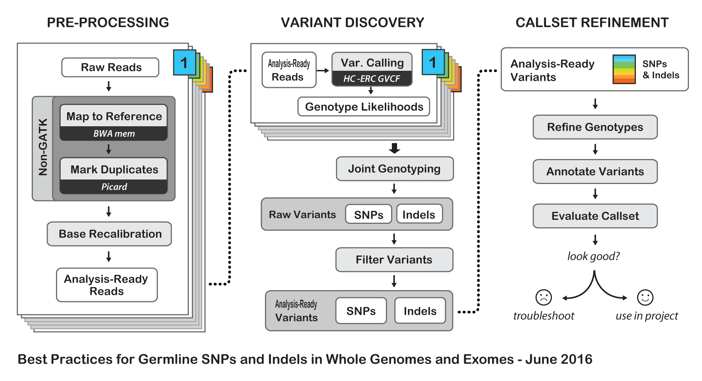
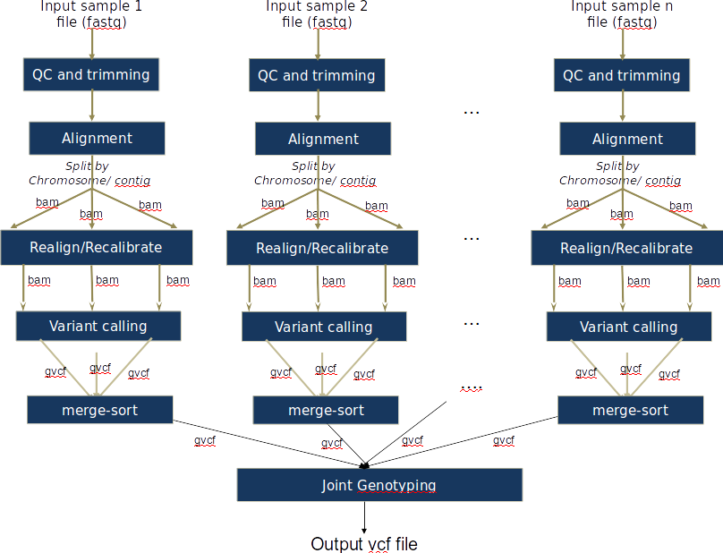
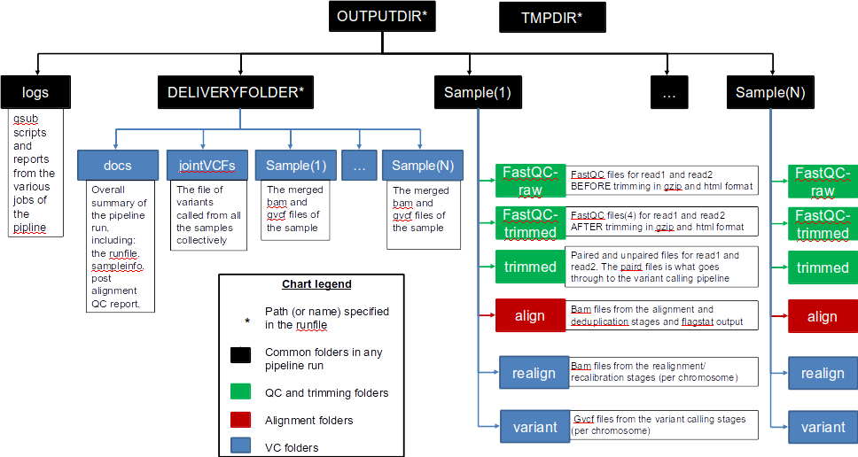

January 2017

1 Pipeline architecture and function
====================================

This pipeline implements the [GATK's best practices](https://software.broadinstitute.org/gatk/best-practices/) for germline variant calling in Whole Exome Next Generation Sequencing datasets, given a cohort of samples.

In its latest version, 3.6, the best practices include the stages shown in Figure \[1\] below, which are:

1.  Mapping to the reference genome
2.  Marking duplicates
3.  Base recalibration (BQSR)
4.  Variant calling –----- (processing done per sample)
5.  Joint genotyping –----- (processing done for all samples together)

These stages are implemented in this pipeline, with an optional “Indel Realignment” step (which was recommended in previous GATK best practices &lt; 3.6). With an optional additional stage of checking the quality of input data and trimming, the pipeline can also be run as: 
* Alignment stage only, 
* Complete variant calling with realignment, and 
* Complete variant calling without realignment,
depending on the user’s ANALYSIS setting.

<span id="_5gqwfmpxrsjj"
class="anchor"></span>

Figure 1: Best Practices for Germline SNPs and Indels in Whole Genomes and Exomes

Under the hood, this pipeline splits and merges files at different stages to achieve optimal usage of resources. This parallelization of data processing is shown in Figure \[2\] below:



Figure 2: Pipeline details. Note: the processing can be split by individual sequences in the reference FASTA file, which could be individual chromosomes, scaffolds, contigs, etc.

1.2. Workflow assumptions

- Inputs are fastq not bam (the RESORTBAM os not active)
- Temporary files are not removed (the REMOVETEMPFILES is not active)
- The AnisimovLauncher is not used in this workflow
- To allow for adapter trimming using trimmomatic, the following variables are needed in the runfile: SAMPLEINFORMATION, OUTPUTDIR, TMPDIR, ADAPTERS, FASTQCDIR, TRIMMOMATICDIR, in addition to PBS torque parameters: PBSCORES, PBSNODES, PBSQUEUE, PBSWALLTIME and EMAIL


2 Dependencies
==============

2.1 Software tools
------------------

The pipeline implements the stages of Figure \[1\] and \[2\], while allowing different software tools at some of the stages depending on user's preference. These are as shown in table \[1\] below, and it is assumed that users would specify the path to each of them in their runfile as shown in section 2.3.

Table 1: Pipeline tools

  ---------------------------------------------------------------------------------------------------------------------------------------------------------------------------------------------------------------------------------------------------------------------------------------------------------------
|  **Stage** |  **Tool options** |
| --------------- | ------------------------- |
|  Quality control |            [Fastqc](http://www.bioinformatics.babraham.ac.uk/projects/fastqc/)|
|  Illumina reads trimming  |   [Trimmomatic](http://www.usadellab.org/cms/?page=trimmomatic)|
|  Alignment |                  [Bwa mem](https://github.com/lh3/bwa), [Novoalign](http://novocraft.com/) |
|  Marking duplicates  |        [Samblaster](https://github.com/GregoryFaust/samblaster), [Novosort](http://novocraft.com/),[Picard](https://broadinstitute.github.io/picard/) |
|  Indel realignment  |         [GATK](https://software.broadinstitute.org/gatk/download/) |
|  Base recalibration  |        [GATK](https://software.broadinstitute.org/gatk/download/) |
|  Calling variants  |         GATK [HaplotypeCaller](https://www.broadinstitute.org/gatk/gatkdocs/org_broadinstitute_gatk_tools_walkers_haplotypecaller_HaplotypeCaller.php) |
|  Joint calling of variants  | GATK ([GenotypeGVCFs](https://www.broadinstitute.org/gatk/gatkdocs/org_broadinstitute_gatk_tools_walkers_variantutils_GenotypeGVCFs.php) ) |
|  Miscellaneous      |         [Samtools](http://samtools.github.io/).  Note: one alternative to samtools (and marking duplicates) is *sambamba*, but it is *not currently implemented* in the code.|
 

2.2 Databases and resources
---------------------------

For this pipeline to work, a number of standard files for calling variants are needed, namely the reference sequence, database of known variants and the adapter sequence to be trimmed. The full path to all these needs to be specified in the User’s runfile as specified in section 2.3

It is important to note that the reference sequence should be prepared first, following [the GATK’s guidelines](http://gatkforums.broadinstitute.org/wdl/discussion/2798/howto-prepare-a-reference-for-use-with-bwa-and-gatk).

For working with human data, one can download most of the needed files from [the GATK’s resource bundle](http://gatkforums.broadinstitute.org/gatk/discussion/1213/whats-in-the-resource-bundle-and-how-can-i-get-it). Missing from the bundle are the index files for the aligner, which are specific to the tool that would be used for alignment (i.e., bwa or novoalign in this pipeline)

To achieve the parallelization of Figure \[2\] in the realignment/recalibration stages, the pipeline needs a separate vcf file for each chromosome/contig, and each should be named as: \*\${chr\_name}.vcf. If working with the GATK bundle, the sample script ([*splitVCF-by-chromosome.sh*](https://github.com/HPCBio/BW_VariantCalling/blob/ParameterSweep/splitVCF-by-chromosome.sh)) can be used to produce the needed files with some minor modifications (mainly, providing the right path to the referencedir, java and GenomeAnalysisTK.jar)

2.3 User’s runfile and sample information files
-----------------------------------------------

To run a specific stage of the pipeline, in addition to specifying the needed script file, the user needs to supply 2 additional files, these are the runfile and the sampleinfo files.

The `sampleinformation` file contains the information about the samples to be processed by the pipeline. In its current implementation, it can analyze paired end WES/WGS data in fastq/fq/fastq.gz/fq.gz format only. These should be specified in tabular form of 3 columns separated by ‘space’, and according to the format below:
```
sample_name full/path/to/read1file full/path/to/read2/file
```
The `runfile` file contains all the details regarding a specific run of the pipeline, including the tools of section 2.1, resources of section 2.2, and the sampleinformation file path as well. It would change depending on the analysis type required.

In a nutshell, the template below shows the various parameters and how they can be specified. It should be noted that the pipeline is case sensitive to the parameters’ names.

  -------------------------------------------------------------------------------------------------------------------------------------------------------------------------------------------------------------------------------------------------------------------------------------------------
```
## i/o
  SAMPLEINFORMATION=<path to the sampleinformation file>
  OUTPUTDIR=<path to the output directory>
  DELIVERYFOLDER=<path where summary deliverables from the pipeline are stored. It is a subdirectory within the OUTPUTDIR>
  TMPDIR=<path to where temporary files are stored>
  SCRIPTDIR=<path to where the scripts of this repo are stored locally on the machine>
  EMAIL=<email address to send torque notifications to\*>
  REPORTTICKET=<redmine ticket number to send notifications to\*>

## choose the run case
  ANALYSIS=<depending on the analysis type it can be {ANALYSIS=ALIGNMENT, or ANALYSIS=ALIGN or ANALYSIS=ALIGN\_ONLY} for alignment only, {ANALYSIS=VC\_WITH\_REALIGNMENT} for complete variant calling with realignment, or anything else for complete variant calling without realignment>

## Read group information for the samples: namely, the Library, Platform technology, and sequencing center name. It should be noted that the sample ID, platform unit (PU) and sample name (SM) are set by default to be the same sample name found in the sampleinformation file specified
  SAMPLELB=<name of the library>
  SAMPLEPL=<should be either ILLUMINA, SOLID, LS454, HELICOS or PACBIO>
  SAMPLECN=<name of the sequencing center generating the reads>

## The tools to be used in this run of the pipeline (where a selection can be made)
  ALIGNERTOOL=<the tool to be used for the alignment stage of the pipeline. Can be either BWAMEM or NOVOALIGN. Only the respective INDEX and PARAMS need to be specified in the next block of the runfile>
  MARKDUPLICATESTOOL=<the tool to be used for marking duplicates in the pipeline. Can be any of these: samblaster, novosort or PICARD>

## Alignment block parameters and Trimming options.
  BWAINDEX=<Path to the indexed reference file for bwa, if it is the desired aligner >
  BWAMEMPARAMS=<optional parameters to bwa mem, if used as an aligner. Example: -k 32 -I 30,30>
  NOVOALIGNINDEX=<path to the indexed reference file for novoalign, if it is the desired aligner>
  NOVOALIGNPARAMS=<optional parameters to novoalign, if used as an aligner>
  CHRNAMES=<a colon (:) separated list of chromosome or contig names to split files by. Only these regions will be processed in the stages following the alignment>
  TRIMMOMATICPARAMS=<parameters to trimmomatic for trimming illumina reads. Example :2:20:10 LEADING:5 TRAILING:5 MINLEN:25>

## Quality thresholds (for reporting only, as the pipeline will continue with the next stage regardless of whether these thresholds were respected or not):
  MAP_CUTOFF=<minimum mapping quality of reads to pass QC test after alignment>
  DUP_CUTOFF=<maximum duplication level in reads to pass QC test after alignment>

## paths to resources and tools - See section 2.1 and 2.2
  ADAPTERS=<path to the adapter file to be used with trimmomatic>
  REFGENOMEDIR=<path to the directory where all reference files and databases are stored>
  REFGENOME=<name of the reference genome file within REFGENOMEDIR. Example ucsc.hg19.fasta in the GATK bundle 2.8>
  DBSNP=<name of the dbsnp file within REFGENOMEDIR. Example dbsnp\_138.hg19.vcf in the GATK bundle 2.8>
  INDELDIR=<name of the directory within REFGENOMEDIR that contains a vcf file for each chromosome/contig specified by the CHRNAMES parameter. These files need to be named as: \*\${chr\_name}.vcf >
  OMNI=<name of the omni variants file. Example: 1000G\_omni2.5.hg19.sites.vcf in the GATK bundle 2.8>

# Example entries for tools’ path in biocluster
  TRIMMOMATICDIR=/home/apps/trimmomatic/trimmomatic-0.33/trimmomatic-0.33.jar
  FASTQCDIR=/home/apps/fastqc/fastqc-0.11.4
  BWAMEMDIR=/home/apps/bwa/bwa-0.7.15
  NOVOCRAFTDIR=/home/apps/novocraft/novocraft-3.02
  SAMBLASTERDIR=/home/apps/samblaster/samblaster-0.1.22/bin
  PICARDIR=/home/apps/picard-tools/picard-tools-2.4.1
  GATKDIR=/home/apps/gatk/gatk-3.6
  SAMDIR=/home/apps/samtools/samtools-1.3.1/bin
  JAVADIR=/home/apps/java/jdk1.8.0\_65/bin

## pbs torque resources
  ALLOCATION=<chargeable allocation>
  PBSNODES=<number of nodes>
  PBSCORES=<number of cores>
  PBSQUEUE=<name of the queue>
  PBSWALLTIME=<wall time>
  
  ```

  -------------------------------------------------------------------------------------------------------------------------------------------------------------------------------------------------------------------------------------------------------------------------------------------------

\* These are needed to track the execution of the various pipeline stages. See section 2.5 for more details

2.4 Pipeline usage and naming conventions
-----------------------------------------

[This pipeline](https://github.com/HPCBio/BW_VariantCalling/tree/ParameterSweep) can be invoked in one of 3 ways depending on analysis requirement. These are specified in the table below. Additionally, example runfiles corresponding to each analysis scenario are given in the `config` directory of the repository.

  **Desired analysis scenario**          |                              **Invoke as+**
  ---------------------------------- | -------
  Quality Control check of the raw reads and trimming       |           `bash trim_input.sh <runfile>`
  Aligning reads to a reference and basic quality control thereafter |  `bash start.sh <runfile>*`
  Complete variant calling, including the realignment stage    |       ` bash start.sh <runfile>`
  Complete variant calling, without the realignment stage       |      ` bash start.sh <runfile>`
  Resume execution after a failing job                    |            ` bash resumePartialExectuion.sh <path to the logs directory from the failed run of the workflow> <name of the task to be resubmitted- see section 2.5>`

\+ Better to use nohup to run your analysis, as in: `nohup <script_name> <needed_file> > log.nohup` to be able to track the run quickly, and also log off freely afterwards.
\* The ANALYSIS parameter in the runfile needs to be configured as was
described in section 2.3 for each case.

2.5 Tasks management and naming conventions
--------------------
 
The pipeline breaks down the analysis stages on per sample and chromosome basis as is shown in Figure 2. It does so with the help of PBS torque resource manager to handle the various dependencies and scheduling of tasks. Accordingly, it keeps log files of each analysis stage in the logs output directory (Figure 3) with names that follows the convention:

-   `qsub.computation\_phase.sample\_name` = pbs torque script for a certain stage in the analysis, corresponding to a specific sample

-   `qsub.computation\_phase.sample\_name.chromosome` = pbs torque script for a certain stage in the analysis, corresponding to a specific sample's chromosome

-   `log.computation\_phase.sample\_name.in` = Error log for a certainqsub job (including warnings, and execution status of corresponding scripts)

-   `log.computation\_phase.sample\_name.ou` = Output log for a certain qsub job

-   `pbs.COMPUTATIONSTAGE` = list of jobids for that stage in the workflow (lists together jobs that delineate a major block of computation)

-   `Anisimov.computation.joblist` = Tab separated file specifying output directories and jobs to be run by the Anisimov Launcher
 
Besides that, it also tracks the execution of the various stages by sending email notification of qsub jobs (the EMAIL parameter in the runfile), and also by reporting a summary of a given run in [redmine](http://www.redmine.org) . In its current implementation, the pipeline will send these to HPCBio’s redmine instance, and the given ticket number (the REPORTTICKET parameter in the runfile)

2.6 Repo index/ The scripts
---------------------------

The details of the remaining files of the repo are as in the table below:

  **Script**             |        **Description**
  ----------------|-------------- 
  `align_dedup.sh`          |      The script to carry out the alignment job
  `realign_varcall_by_chr.sh`  | The script to carry out the realignment, recalibration and variant calling jobs
  `merge_vcf.sh`            |      The script to merge the bams (we split the per-sample bams by chromosome/contig in the realignment /recalibration stage, and now we merge that)
  `joint_vcf.sh`             |     The script to carry out the joint variant calling job
  `summary.sh `            |        The script to generate summaries about the last run of the pipeline (which jobs/samples failed/succeeded)

The remaining files are not used as part of the variant calling pipeline of Figure \[2\] but are documented here for future use if needed. They are provided as-is, and are likely to require some debugging to be fully working properly.

  **Script**      |      **Description**
  --------------|------- 
  `start_vqsr.sh`      |  A script (pipeline to do VQSR) to the per-sample raw vcf files after calling the variants using the start.sh pipeline. It does so by calling the recalibrate\_vcf.sh script. It expects a sampleinfo file that lists the locations of the rawvcf files resulting from running the start.sh pipeline
  `recalibrate_vcf.sh` |  A script to do VQSR to both snps and indels. Actually, in its current form it doesn't produce the right results (VQSR is a 2-stage process (modelling then applying the model), and the stages should be carried out in this order for SNPs and then Indels. ***I’m not sure it would still give the right results if the SNPs and Indels models were built first, and then applied; which is the current implementation)***
  `mutect2_1pair.sh`  |   A script to call variants in normal/tumor samples using mutect2 from the GATK
  `read_fate.sh`    |     A script to generate an overall summary of the alignment job (parsed from the alignment log files), containing the total number of reads, total mapped reads, total duplicates, percentage duplicates and percentage mapped reads
  `index_bams.sh`  |      A script to index recalibrated bam files. It is said to be needed to run Mutect2, ***but not sure***
  `vcfstats.sh `   |       A script to generate vcf stats on all vcfs resulting from the workflow (QC step)

3 Results
=========

The results from a typical run of the pipeline are organized according to the hierarchy shown in Figure \[3\] below. Overall, the `DELIVERYFOLDER` contains the key summarizing files of the run (the cleaned up bams, gvcfs and final vcf from joint calling; in addition to the summary reports regarding the quality of the data, and copies of the
`sampleinformation` and `runfile` files). Each sample also has its own directory that contains the files generated after each stage. In Figure \[3\], a color coding schema is employed to differentiate the files that would be generated according to how the user specifies the `ANALYSIS` parameter in the `runfile`.

{width="6.692716535433071in"
height="3.5694444444444446in"}

Figure 3: Output directories and files generated from a typical run of
the pipeline

One way to test the functionality of this pipeline, is to run it against a test dataset for which the truth is known (i.e., there exists a vcf file with true variants). The Genome in a Bottle Consortium (GIAB), curates such data including the raw fastq files, the cleaned bams, and the final variants file.

As an example, the pipeline was run using the whole exome sequence dataset of sample NA12878 as produced by [the Garvan Institute](http://www.garvan.org.au/research/kinghorn-centre-for-clinical-genomics/clinical-genomics/sequencing-services/sample-data)

Calling the variants in the data produced by Robot1 (i.e. replicate 1) of an average \~34X, and the default parameters of the pipeline, the concordance between the final vcf file (query file) produced from the pipeline and the truth dataset obtained from the Garvan institute website is as show in the table below (as generated by [hap.py](https://github.com/Illumina/hap.py))

> Table 1: Benchmarking summary\*

  Type  |  Filter |  Total Golden vcf variants |  True positives |  False negatives |  Total workflow vcf variants |  False positives |  ***Recall*** |  ***Precision***
  -------| --------| ---------------------------| ----------------| ----------------- |----------------------------- |----------------- |-------------- |-----------------
  INDEL  |  ALL  |     803045  |  767492    |       35553   |           886700|        119213 |           0.955727 |      0.865554
  INDEL  | PASS   |  803045 |                     764680       |    38365    |         883879     |                   119204    |        0.952226   |    0.865135
  SNP  |   ALL    |  3689294     |                3614155     |     75139       |      3806647        |               192500    |        0.979633      | 0.949431
  SNP |    PASS   |  3689294            |         3523155     |     166139     |       3714249             |          191102    |        0.954967    |   0.948549

\* This table is extracted from hap.py summary output reports. The
scripts to obtain this data and perform the benchmarking are in the
\`GIAB\_example\` directory of the repo

4 Advanced options
==================

For more handle of the pipeline, there is a possibility to examine the
effect of parameter changes in some of the stages; namely, the alignment
and the Base Recalibration stage.

The scripts to allow such functionality are in the \`ParameterSweep\`
directory of the repo, and they employ the same runfile and
sampleinformation structure shown in section 2.3.

For running these scripts, it is assumed that the user has R installed
and accessible, along with the following libraries: gsalib, ggplot2,
reshape, gplots (required for some of the GATK tools:
https://software.broadinstitute.org/gatk/guide/article?id=2899), dplyr,
doParallel, foreach, RColorBrewer (required for the supplied R scripts)

The effect of changing the parameters in the alignment stage (using bwa
mem) can be shown as a function of the average quality of the alignment
(the mean MAPQ field in the sample’s bam file). Contrary, the effect of
changing the parameters in the Base Recalibration stage can be shown as
a function of the error (the difference between the reported and
empirical quality of the bases).

Both functionalities can be invoked by running the commands below
respectively:

  -------------------------------------------------------------------------
  nohup start\_bwa.sh <runfile> &gt; bwa\_sweep\_log.nohup

  nohup start\_bqsr\_sweep.sh <runfile> &gt; bqsr\_sweep\_log.nohup
  -------------------------------------------------------------------------
  -------------------------------------------------------------------------

The results of invoking either stage is integrated into the tree
structure of Figure 3 as 2 additional directories called ‘sweepBWA’ and
‘sweepBQSR’ with subfolders for each parameter, and with an overall
summary files bqsr.summary.txt (detailing whether it was successful
setting the parameter to a particular value, and also how long the
processing took)

Figure 4 below shows sample results from changing the &lt;&gt; parameter
in bwa for the GIAB sample, while Figure 5 shows the results on the same
sample when varying the &lt;&gt; parameter in the BaseRecalibration
stage for chromosome &lt;&gt;
